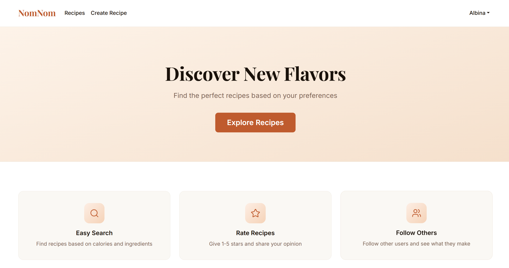
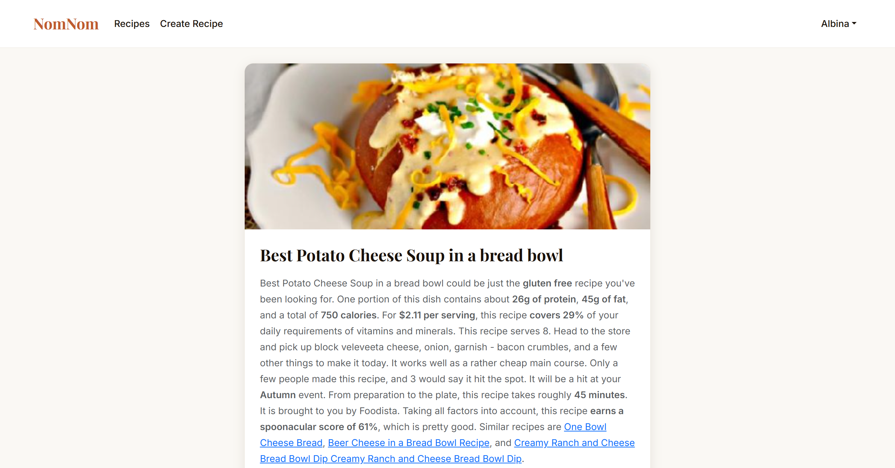
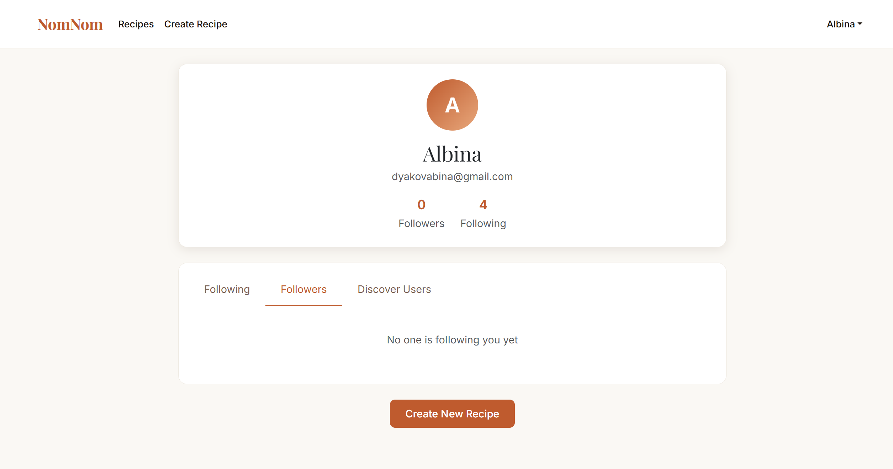
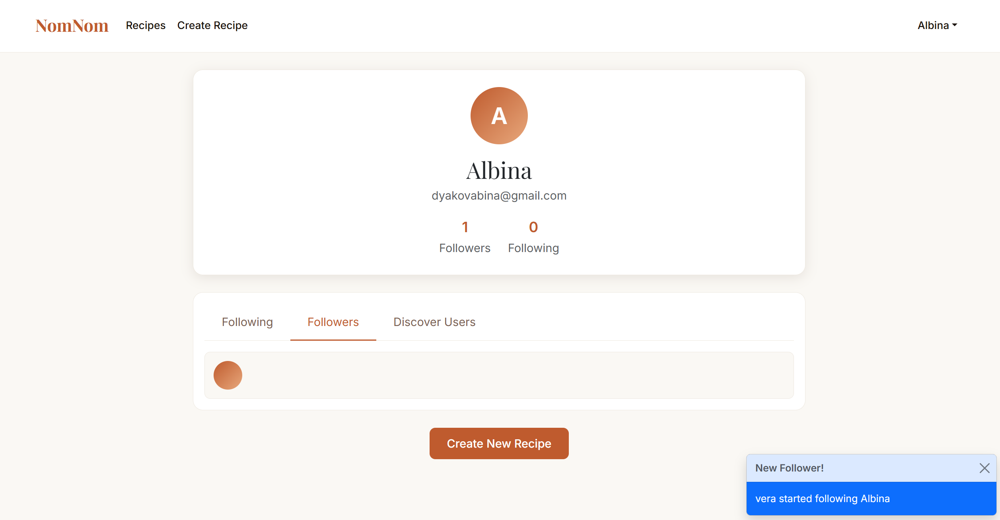

# NomNomApp


A full-stack recipe management and social platform where users can discover recipes, create their own, rate and comment on them, follow other users, and receive real-time notifications.

---

## Screenshots

<table>
  <tr>
    <td></td>
    <td></td>
  </tr>
  <tr>
    <td align="center"><b>Home</b></td>
    <td align="center"><b>Recipe Detail</b></td>
  </tr>
  <tr>
    <td></td>
    <td></td>
  </tr>
  <tr>
    <td align="center"><b>Profile</b></td>
    <td align="center"><b>Notifications</b></td>
  </tr>
</table>

---

## Tech Stack

| Layer    | Technology                                      |
| -------- | ----------------------------------------------- |
| Frontend | React 19, TypeScript, Vite, Bootstrap           |
| Backend  | ASP.NET Core 10 (.NET 10), C#                   |
| Database | PostgreSQL 16 (Docker)                          |
| ORM      | Entity Framework Core 10                        |
| Auth     | JWT in HTTP-only cookies + refresh token rotation |
| Storage  | Cloudinary (photo uploads)                      |
| Realtime | Server-Sent Events (SSE)                        |
| External | Spoonacular API (recipe data)                   |
| CI/CD    | GitHub Actions (build, test, Docker push to GHCR) |

## Features

- **Recipe Discovery** — Search recipes by nutrients via the Spoonacular API
- **Custom Recipes** — Create and save your own recipes with ingredients and photos
- **Comments & Ratings** — Rate recipes (1–5 stars) and leave comments with pagination
- **User Profiles** — View profiles with follower/following lists and paginated user search
- **Follow System** — Follow other users and discover new people
- **Real-time Notifications** — Receive toast notifications for new follows and comments via SSE
- **Authentication** — Secure registration and login with JWT in HTTP-only cookies and refresh token rotation

## Prerequisites

- [.NET 10 SDK](https://dotnet.microsoft.com/download)
- [Node.js](https://nodejs.org/) (v22+)
- [Docker](https://www.docker.com/) (for PostgreSQL)

## Getting Started

### 1. Start the database

```bash
docker-compose up -d
```

Starts a PostgreSQL 16 container on port `5432`.

### 2. Configure the backend

Copy the example config and fill in your values:

```bash
cp server/server/appsettings.Example.json server/server/appsettings.Development.json
```

See [`appsettings.Example.json`](server/server/appsettings.Example.json) for all required fields.

### 3. Run the backend

```bash
cd server/server
dotnet ef database update
dotnet run
```

API starts at `https://localhost:5001`.

### 4. Configure the frontend

```bash
cp client/.env.example client/.env.development
```

See [`.env.example`](client/.env.example) for all required variables.

### 5. Run the frontend

```bash
cd client
npm install
npm run dev
```

App starts at `http://localhost:5173`.

## Running with Docker

Build and run the full stack:

```bash
docker-compose up --build
```

Images are published to GitHub Container Registry on every push to `main`.

## Project Structure

```
NomNomApp/
├── client/                          # React frontend
│   ├── src/
│   │   ├── components/              # Pages and UI components
│   │   ├── context/                 # AuthContext, SseContext
│   │   ├── hooks/                   # Custom hooks (useSse)
│   │   └── lib/api/                 # Axios client and types
│   └── Dockerfile
│
├── server/
│   ├── server/                      # ASP.NET Core API
│   │   ├── Data/                    # EF Core DbContext
│   │   ├── Domain/                  # Entity models
│   │   ├── Features/
│   │   │   ├── Auth/
│   │   │   │   ├── AuthController.cs
│   │   │   │   ├── Infrastructure/
│   │   │   │   │   ├── Jwt/         # IJwtService, JwtService, JwtOptions
│   │   │   │   │   └── Password/    # IPasswordHasher, PasswordHasher
│   │   │   │   ├── Login/           # LoginHandler, LoginRequest, LoginResponse
│   │   │   │   ├── Register/        # RegisterHandler, RegisterRequest, RegisterMapper
│   │   │   │   ├── RefreshToken/    # IRefreshTokenService, RefreshTokenService
│   │   │   │   ├── GetAllUsers/
│   │   │   │   ├── GetCurrentUser/
│   │   │   │   └── Shared/          # UserResponse
│   │   │   ├── Comments/            # Comments & ratings
│   │   │   ├── Follows/             # Follow system
│   │   │   ├── Recipes/             # Recipe CRUD & Spoonacular integration
│   │   │   ├── Sse/                 # Real-time event streaming
│   │   │   └── Shared/              # Result pattern, PageList, PageParameters
│   │   ├── Migrations/
│   │   └── Dockerfile
│   └── server.Tests/                # xUnit tests (NSubstitute, SQLite in-memory)
│
├── docker-compose.yml
└── .github/workflows/ci.yml         # CI: build → test → Docker push
```

## API Endpoints

### Auth
| Method | Endpoint                    | Description                        |
| ------ | --------------------------- | ---------------------------------- |
| POST   | `/api/auth/register`        | Register and receive tokens        |
| POST   | `/api/auth/login`           | Login and receive tokens           |
| POST   | `/api/auth/logout`          | Revoke refresh token, clear cookie |
| POST   | `/api/auth/refresh-token`   | Rotate refresh token               |
| GET    | `/api/auth/me`              | Get current user                   |
| GET    | `/api/auth/users`           | List users (paginated)             |

### Recipes
| Method | Endpoint              | Description                    |
| ------ | --------------------- | ------------------------------ |
| GET    | `/api/recipe/{id}`    | Get recipe by ID               |
| GET    | `/api/recipe/search`  | Search recipes by nutrients (paginated) |
| POST   | `/api/createrecipe`   | Create a custom recipe         |

### Comments
| Method | Endpoint                               | Description              |
| ------ | -------------------------------------- | ------------------------ |
| POST   | `/api/comments/recipe/{recipeId}`      | Add comment/rating       |
| GET    | `/api/comments/recipe/{recipeId}`      | Get comments (paginated) |
| GET    | `/api/comments/recipe/{recipeId}/score`| Get average rating       |
| DELETE | `/api/comments/{commentId}`            | Delete a comment         |

### Follows
| Method | Endpoint                      | Description           |
| ------ | ----------------------------- | --------------------- |
| POST   | `/api/follows/{userId}`       | Follow a user         |
| DELETE | `/api/follows/{userId}`       | Unfollow a user       |
| GET    | `/api/follows/followers`      | Get your followers    |
| GET    | `/api/follows/following`      | Get who you follow    |
| GET    | `/api/follows/check/{userId}` | Check follow status   |

### SSE
| Method | Endpoint            | Description                   |
| ------ | ------------------- | ----------------------------- |
| GET    | `/api/sse/stream`   | Subscribe to real-time events |

## Architecture

The backend follows **Vertical Slice Architecture (VSA)** — each feature is self-contained with its own controller, handler, request/response types, and infrastructure. Cross-cutting concerns:

- **Result pattern** — consistent `Result<T>` for success/failure across all handlers
- **PageList\<T\>** — unified pagination wrapper with `Items`, `Count`, `HasNextPage`
- **Provider interfaces** — `IRecipeProvider`, `IPhotoProvider` abstract external services
- **IRefreshTokenService** — injectable interface enabling handler unit tests without DB

The frontend uses React **Context API** for global state (auth and SSE) and **Axios** for API calls with automatic cookie credential handling.

## Running Tests

```bash
cd server
dotnet test server.Tests/Server.Tests.csproj --verbosity normal
```

Tests use **xUnit**, **NSubstitute** for mocking, and **SQLite in-memory** for database integration tests.
